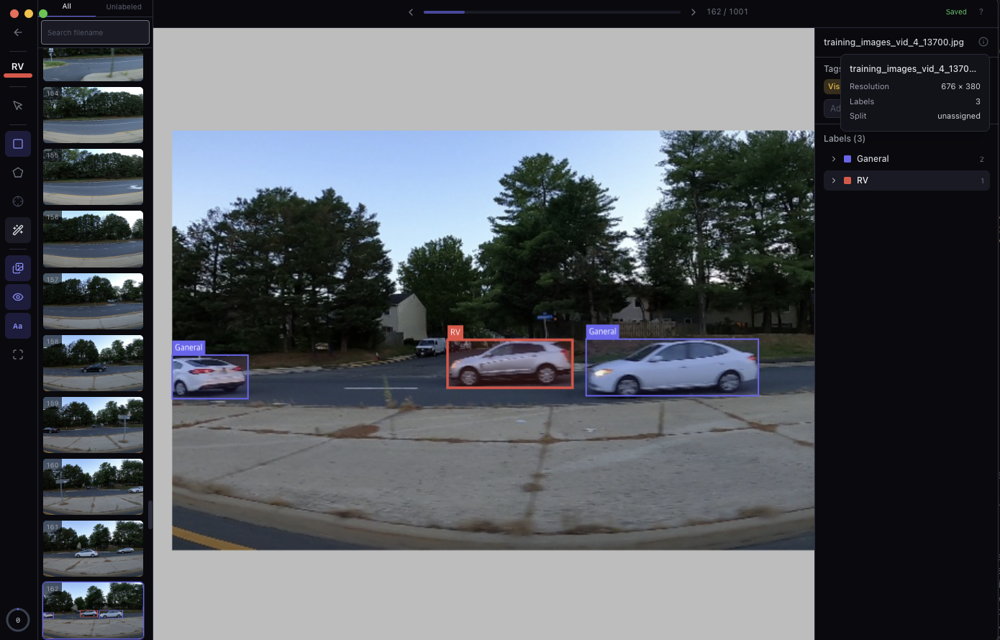
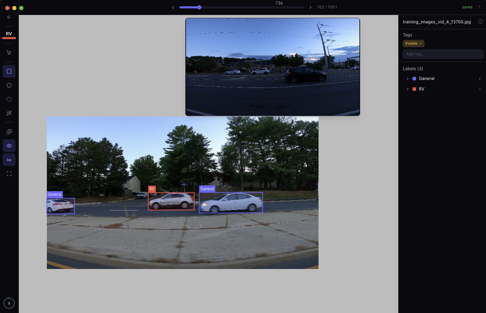
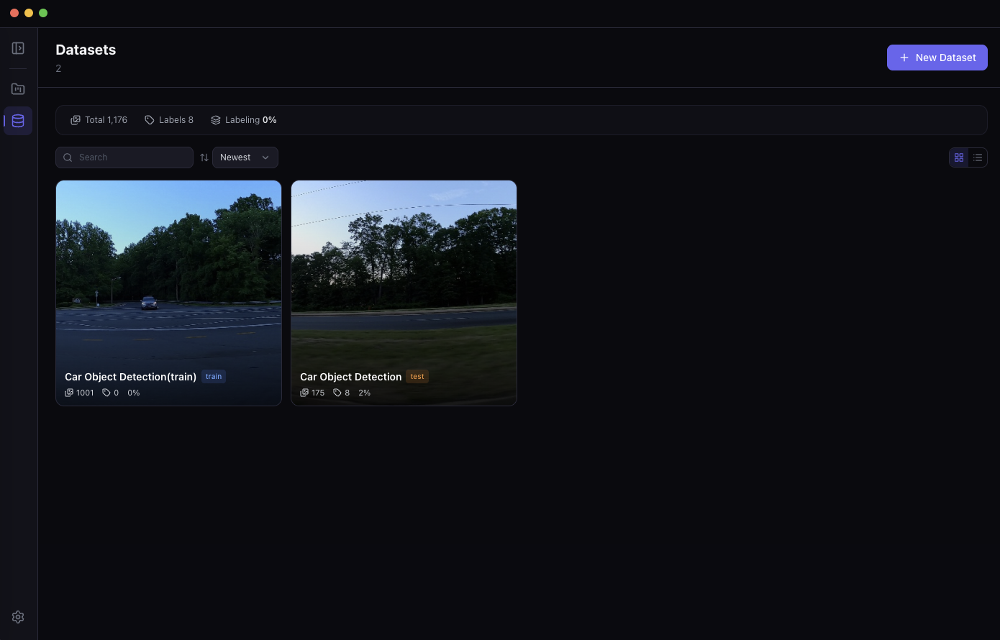
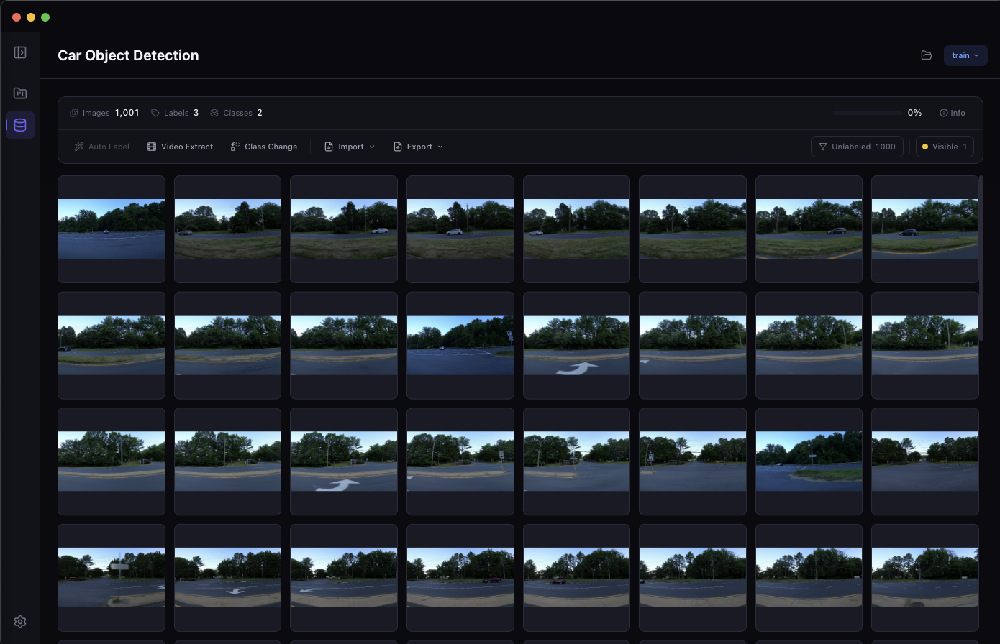
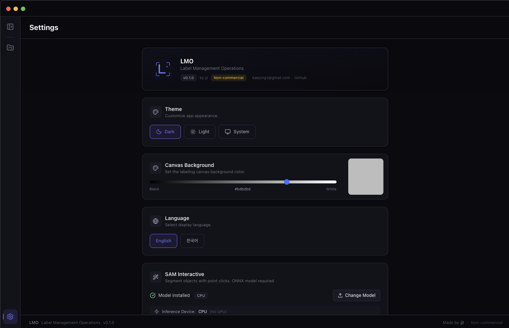
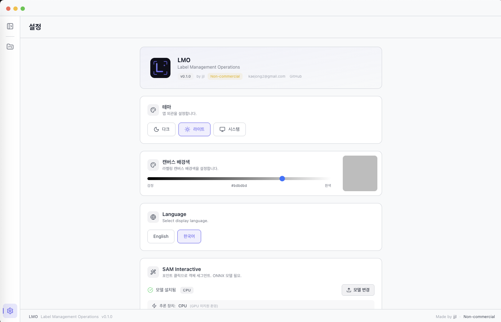

<p align="center">
  
</p>

<h1 align="center">LMO</h1>
<p align="center"><strong>Label Management & Operations</strong></p>
<p align="center">Desktop image annotation tool for computer vision</p>

<p align="center">
  
  
  
</p>

<p align="center">
  <a href="https://github.com/lmo-shed/lmo/releases"><strong>Download</strong></a>
</p>

---

## Overview

LMO is a lightweight desktop labeling tool built with Electron. Create bounding boxes, polygons, and keypoints with skeleton — import and export in COCO, CVAT, and YOLO formats.

---

## Screenshots

<p align="center">
  
  
</p>
<p align="center">
  
  
</p>
<p align="center">
  
  
</p>

---

## Features

### Annotation Tools
| Tool | Key | Description |
|------|-----|-------------|
| **Select** | `A` | Click to select, drag to move, resize handles |
| **BBox** | `W` | Click & drag to draw, arrow key nudge |
| **Polygon** | `E` | Vertex placement, edge insert, right-click delete |
| **Keypoint** | `R` | Per-class templates with skeleton, multi-select drag |
| **SAM** | `C` | Interactive point-click segmentation (NVIDIA GPU) |
| **Context Menu** | `V` | Quick class change, attributes |

### Workflow
- **Undo / Redo** — `Ctrl+Z` / `Ctrl+Y`
- **Copy / Paste** — `Ctrl+C` / `Ctrl+V` (with offset)
- **Multi-select** — `Ctrl+Click`, `Shift+Click`, `Ctrl+A`
- **Label lock** — `L` to prevent accidental edits
- **Delete under cursor** — `D` to quickly remove a bbox
- **Image tags** — Notion-style multi-select with auto-complete

### Data Management
- **Project → Dataset** hierarchy with roles (train / val / test)
- **Import** — COCO, CVAT XML, YOLO, images, video frames (ffmpeg)
- **Export** — COCO, CVAT XML, YOLO → `annotations/` folder
- Move images between datasets (labels follow)
- Filesystem sync detection

### UI / UX
- Dark / Light / System theme
- Adjustable canvas background color
- Customizable keyboard shortcuts
- Statistics dashboard — class distribution, progress, tags
- Tag-based image filtering
- i18n — English, Korean

---

## Download

Get the latest build from [**Releases**](https://github.com/lmo-shed/lmo/releases).

| Platform | File | Note |
|----------|------|------|
| Windows | `.exe` | NSIS installer |
| Linux | `.deb` | Ubuntu / Debian |

---

## Quick Start

1. **Download & install** from Releases
2. **Create a project** — select a folder
3. **Create a dataset** — give it a name
4. **Import images** — drag & drop, folder import, or video frame extraction
5. **Start labeling** — click an image to open the editor

---

## Keyboard Shortcuts

All shortcuts are customizable in **Settings**.

### Tools

| Key | Action |
|-----|--------|
| `A` | Select |
| `W` | BBox |
| `E` | Polygon |
| `R` | Keypoint |
| `C` | SAM |
| `V` | Context Menu |

### Actions

| Key | Action |
|-----|--------|
| `Ctrl+Z` | Undo |
| `Ctrl+Y` | Redo |
| `Ctrl+C` | Copy |
| `Ctrl+V` | Paste |
| `Ctrl+A` | Select all |
| `Delete` | Delete selected |
| `D` | Delete bbox under cursor |
| `H` | Toggle label visibility |
| `T` | Toggle class names |
| `L` | Toggle lock |

### Navigation

| Key | Action |
|-----|--------|
| `Z` / `X` | Previous / Next image |
| `Shift+Z` / `Shift+X` | Skip 10 images |
| `F` | Fit to screen |
| `G` | Toggle image list |
| `Space + Drag` | Pan |
| `Scroll` | Zoom |
| `Arrow` | Move label 1px |
| `Shift+Arrow` | Move label 10px |

---

## SAM Interactive Setup

Point-click segmentation powered by ONNX Runtime. Requires **NVIDIA GPU + CUDA**.

### Prepare model

Download SAM ONNX models (e.g. from [HuggingFace](https://huggingface.co/models?search=sam2+onnx)) and zip:

```
sam_models.zip
├── vision_encoder_fp16.onnx
├── vision_encoder_fp16.onnx_data
├── prompt_encoder_mask_decoder_fp16.onnx
└── prompt_encoder_mask_decoder_fp16.onnx_data
```

### Load in LMO

**Settings** → **SAM Interactive** → **Upload Model (.zip)** → select zip → done.

Press `C` in the labeling view to activate SAM mode.

> SAM requires NVIDIA GPU with CUDA. Not available on CPU-only or macOS.

---

## Supported Formats

| Format | Import | Export |
|--------|--------|--------|
| **COCO** | `*.json` + images | `annotations/coco.json` |
| **CVAT** | `annotations.xml` + images | `annotations/annotations.xml` |
| **YOLO** | `data.yaml` + images/labels | `annotations/labels/*.txt` + `data.yaml` |
| **Image** | jpg, png, bmp, webp | — |
| **Video** | mp4, avi, mov, mkv, webm | frame extraction via ffmpeg |

Keypoint data is preserved across all formats.

---

## Requirements

| Feature | Requires |
|---------|----------|
| Labeling | Nothing — works offline |
| SAM Interactive | NVIDIA GPU + CUDA driver |
| Auto Labeling | Docker |
| Video frames | ffmpeg |

---

## License

This software is free to use but **not for resale**.

- Free for personal, academic, and commercial use
- Selling or redistributing the software itself is prohibited
- Outputs (labeled data, models, etc.) are yours — use them however you want

See [LICENSE](LICENSE) for details.
